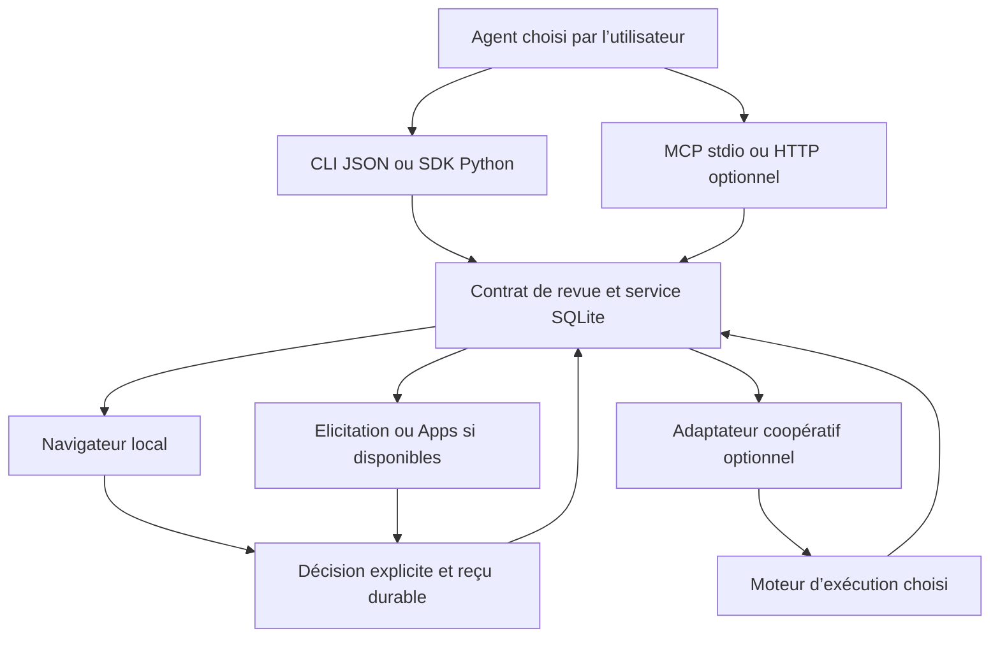

# Plan d’évolution — indépendance des agents et des clients

Date : 3 octobre 2026. **Statut : plan et avancement de l’implémentation locale; qualification externe partielle.**

### Avancement — 0.3.0.dev1, 3 octobre 2026

Le texte ci-dessous conserve le plan proposé. Une première étape est maintenant implémentée localement :

| Lot | État réel |
|---|---|
| M0 | Guide commun et diagnostics distinguant configuration, protocole, hôte et inférence; qualification externe partielle |
| M1 | Superviseur détaché par base, accès renouvelable, MCP rapide et reprise après déconnexion; aucune correspondance de ports distante automatique |
| M2 | Modes elicitation vérifiés, refus/erreur avec repli, navigateur forcé si Apps échoue; messages navigateur anglais/français; Apps commerciales à qualifier |
| M3 | Commandes et neuf exporteurs, fusion JSONC, TOML optionnel, sauvegardes et diagnostics; Cline/Hermes en import manuel; Windows préparé en CI, pas encore exécuté |
| M4 | Exécuteur Codex isolé avec imports compatibles; nouveau contrat moteur et deuxième moteur encore à réaliser |
| M5 | Non commencé; MCP stdio conservé |
| M6 | Tests locaux et découverte Hermes; Claude non authentifié, Gemini refuse l’authentification utilisée; migration ERP et pilote humain non réalisés |
| M7 | Non commencé |

Le jalon v0.3 reste **PARTIEL** tant que deux clients non Codex ne sont pas qualifiés de bout en bout. Voir [le guide livré](AGENT_INTEGRATION.md) et [les preuves](QUALIFICATION.md). Cet état décrit la qualification locale du 3 octobre; les livraisons et validations CI ultérieures sont suivies dans GitHub. Aucune publication du paquet n’est revendiquée.

## 1. Conclusion et périmètre

Le cœur v0.2 est déjà indépendant du fournisseur de modèle : JSON, reçus, SQLite, CLI, interface navigateur et serveur MCP. Aucun compte OpenAI n’est nécessaire pour utiliser ces fonctions. En revanche, le seul exécuteur externe concret est `CodexTextExecutor`, l’installation dans ERP Hospitality cible surtout Codex/Claude, et la qualification réelle d’un agent externe concerne Codex.

Objectif : un utilisateur choisit son agent, installe le bridge dans son projet et retrouve les mêmes propositions, contraintes et décisions. Les fonctions supplémentaires dépendent des capacités réellement disponibles dans son client.

Trois axes seront documentés séparément :

1. **Fournisseur de modèle** : choisi et authentifié par l’agent appelant.
2. **Client d’interaction** : CLI, client MCP, navigateur ou hôte MCP Apps.
3. **Moteur d’exécution** : intégration coopérative capable d’appliquer certaines commandes et de produire des preuves.

Un client capable d’appeler MCP n’est pas automatiquement capable d’arrêter son agent, d’afficher une App ou d’authentifier une décision humaine. Le bridge conserve les frontières de confiance de chaque parcours.

## 2. Constats dans le dépôt

| Constat | Conséquence | Mise à jour |
|---|---|---|
| `adapters.py` rassemble le callback générique et `CodexTextExecutor`; `__init__.py` expose Codex | Intégration de référence trop visible dans la façade commune | Isoler les exécuteurs spécifiques; conserver l’import historique |
| `CooperativeAgent` déclare un ensemble fixe de contrôles; checkpoints entre actions | Ces contrôles ne prouvent pas l’interruption d’un sous-processus actif | Capacités explicites, identités d’exécution, accusés vérifiables |
| `mcp/server.py` démarre seulement en stdio | Les clients qui exigent HTTP ne peuvent pas utiliser cet exécutable tel quel | Transport MCP HTTP optionnel après le socle stdio |
| `api.py` sert les revues dans le navigateur | Son HTTP local n’est pas un transport MCP HTTP | Séparer clairement les deux services et leurs authentifications |
| `visual_bridge_ask_human` peut attendre 600 secondes et ouvre le navigateur du serveur | Timeout du client; mauvais emplacement du navigateur en conteneur ou à distance | Ouverture rapide, URL visible, attente optionnelle et reprise durable |
| `visual_bridge_open_review` fournit un repli texte/données sans session navigateur gérée | Le client sans Apps doit organiser lui-même le parcours navigateur | Fournir un parcours navigateur complet avec durée de vie explicite |
| `ask_question` vérifie seulement la présence de `elicitation` | Un client déclarant uniquement le mode URL peut recevoir une requête de formulaire incompatible | Vérifier le mode `form`, gérer le refus et les erreurs du client |
| Apps testées dans un hôte de référence | Compatibilité commerciale encore à démontrer | Qualification par client et version; repli disponible |
| Installation ERP extérieure au paquet, scripts Bash et chemins POSIX | Réinstallation fragile après déplacement, Windows et autres projets mal couverts | Commandes portables et exporteurs de configuration |
| Texte anglais partiellement traduit; anciens rapports datés | Expérience et statut de livraison ambigus | Traductions dynamiques et matrice de preuves actualisée |

Les commandes proposées ci-dessous n’existent pas encore. Les tests actuels du cœur, du SDK et de l’hôte de référence restent utiles; ils ne remplacent pas les parcours réels dans les nouveaux clients.

## 3. Recherche : intégrations documentées

Les informations suivantes proviennent des sources officielles consultées le 3 octobre 2026. « Documenté » désigne une possibilité annoncée par le produit; « qualifié » exige un essai reproductible de cette version du bridge.

| Client | Configuration / point d’entrée documenté | Livraison prévue | Qualification actuelle du bridge |
|---|---|---|---|
| [Codex](https://developers.openai.com/codex/mcp) | `.codex/config.toml`, table `mcp_servers` | Export TOML; conserver l’intégration existante | Parcours MCP et synthèse en lecture seule testés; pas une qualification de toutes les fonctions |
| [Claude Code](https://code.claude.com/docs/en/mcp) | `.mcp.json`, `mcpServers`; stdio/HTTP, elicitation documentée | Export JSON et instructions projet | Configuration ERP préparée; parcours réel non qualifié |
| [Cursor](https://cursor.com/docs/mcp) | `.cursor/mcp.json`, `mcpServers` | Export projet | À qualifier; Apps/elicitation à détecter |
| [VS Code / Copilot](https://code.visualstudio.com/docs/agent-customization/mcp-servers) | `.vscode/mcp.json`, **`servers`**; Apps documentées | Export propre à VS Code; essai de l’interface native | À qualifier |
| [Gemini CLI](https://geminicli.com/docs/tools/mcp-server/) | `.gemini/settings.json`, `mcpServers`; stdio, `httpUrl` pour Streamable HTTP | Export projet; stdio en premier | À qualifier |
| [OpenCode](https://opencode.ai/docs/mcp-servers/) | `opencode.json`, **`mcp`**, entrée `type: local`, **`command` sous forme de tableau** | Export respectant son schéma | À qualifier |
| [Hermes](https://hermes-agent.nousresearch.com/docs/user-guide/features/mcp/) | `~/.hermes/config.yaml`, **`mcp_servers`** | Fragment YAML; application au fichier global explicitement choisie | À qualifier |
| [Cline](https://docs.cline.bot/mcp/mcp-overview) | Configuration MCP accessible par l’interface; `mcpServers`, commandes et permissions | Fragment à importer; écriture automatique seulement après validation du stockage de la version ciblée | À qualifier |
| [Antigravity](https://www.antigravity.google/docs/mcp) | `.agents/mcp_config.json`, `mcpServers`; HTTP via **`serverUrl`** | Export distinct de Gemini CLI | À qualifier |
| Agent personnalisé sans MCP | CLI/JSON ou SDK Python existants | Exemple neutre et contrat public | Contrats internes testés; moteur concret à qualifier |

La localisation des réglages Gemini est également décrite dans sa [référence de configuration](https://geminicli.com/docs/reference/configuration/). Les variantes, versions et environnements effectivement testés devront figurer dans la matrice; un export de configuration réussi ne vaudra pas preuve d’inférence.

Principes issus des standards :

- MCP définit stdio et Streamable HTTP : le transport doit être explicite, avec protections adaptées à HTTP. [Spécification des transports](https://modelcontextprotocol.io/specification/2025-11-25/basic/transports).
- Elicitation distingue `form` et `url`; une déclaration historique vide reste compatible avec `form`. Annuler, décliner et répondre sont des résultats différents. [Spécification elicitation](https://modelcontextprotocol.io/specification/2025-11-25/client/elicitation).
- Apps ajoute une interface au-dessus des outils MCP; le résultat texte/structuré reste nécessaire. Les capacités de l’iframe sont négociées avec son hôte. [Architecture MCP Apps](https://apps.extensions.modelcontextprotocol.io/api/documents/overview.html).
- ACP décrit l’échange entre un client et un agent. Il mérite une étude ultérieure pour les sessions d’éditeur; son adoption n’est pas requise pour rendre les revues MCP portables. [Présentation ACP](https://agentclientprotocol.com/protocol/v1/overview).

## 4. Architecture cible



Le cœur conserve une dépendance standard Python seulement. MCP et les intégrations restent optionnels. Le bridge ne devient pas un routeur LLM et ne collecte pas les clés des fournisseurs.

Chaque capacité a un état : inconnue, non disponible, annoncée, vérifiée par protocole, qualifiée dans un parcours réel. L’état inconnu ne permet pas d’activer une fonction sensible. La capacité de dialogue et la capacité de contrôler l’exécution sont indépendantes.

## 5. Lots et ordre d’implémentation

### M0 — Contrats et matrice de qualification · P0 · taille S

Modules : `models.py`, documentation, exemples, `docs/QUALIFICATION.md`.

- [ ] Définir les axes client, interface, moteur, version et environnement; enregistrer les capacités observées sans secrets.
- [ ] Décrire un parcours neutre : créer → présenter → soumettre → relire le reçu → réviser → vérifier l’invalidation.
- [ ] Actualiser les preuves de livraison et séparer les résultats historiques des résultats nouveaux.
- [ ] Centraliser les consignes d’usage dans un document indépendant; fournir des références adaptées à AGENTS.md, CLAUDE.md et GEMINI.md sans dupliquer les règles métier.

Acceptation : documentation utilisable sans installer Codex; aucun client non testé présenté comme qualifié. Dépendances : aucune.

### M1 — Parcours navigateur durable, appels MCP courts · P0 · taille L

Modules : `mcp/sdk.py`, `api.py`, `sessions.py`, CLI et stockage.

- [ ] Faire retourner rapidement l’ouverture d’une revue : identifiant, révision, état, méthode de récupération et URL si disponible.
- [ ] Gérer explicitement le cycle de vie du service navigateur : processus local supervisé, état durable, redémarrage et expiration des accès. Éviter une multiplication de serveurs orphelins par revue.
- [ ] Conserver le mode bloquant existant pour compatibilité; limiter l’attente par appel et offrir récupération du reçu/événements après reconnexion.
- [ ] Une session MCP interrompue ne supprime pas la revue et n’accorde aucune permission. Une URL contenant un accès humain n’entre pas dans les exports, métriques ou journaux ordinaires.
- [ ] Détecter local, WSL, conteneur et serveur distant; rendre l’URL utilisable côté utilisateur seulement si la correspondance est configurée. Sinon expliquer la reprise ou l’export, sans inventer un localhost accessible.

Acceptation : un client avec délai court peut terminer la revue, même après déconnexion/reconnexion; absence de réponse = en attente. Dépendances : M0.

### M2 — Négociation et repli des interfaces · P0 · taille M

Modules : `mcp/sdk.py`, `ui/app.ts`, tests de protocole et navigateur.

- [ ] Vérifier `elicitation.form`, avec compatibilité de la déclaration historique vide; ne jamais envoyer un formulaire à un client URL seulement.
- [ ] Gérer capacités absentes, refusées ou annoncées mais défaillantes; proposer le parcours M1 en conservant la question et la révision.
- [ ] Garder texte et données structurées pour Apps; négocier les actions disponibles dans l’iframe. Un échec de message au chat ne doit pas perdre le reçu.
- [ ] Enregistrer la provenance exacte. Une réponse d’hôte, y compris via automatisation du client, n’est pas une preuve indépendante d’auteur humain.
- [ ] Traduire les messages dynamiques français/anglais et expliciter les limites de contrôle dans chaque interface.

Acceptation : le même contrat de décisions reste exploitable avec Apps, formulaire, navigateur ou JSON. Les provenances restent distinctes. Dépendances : M1 pour le repli complet.

### M3 — Installation portable et diagnostics · P0 · taille L

Modules proposés : `installation/`, `clients/`, extensions de `cli.py`, guides et tests d’export.

- [ ] Ajouter `setup`, `doctor` et `mcp`; exports sélectionnés par client, sans supposer une configuration JSON universelle.
- [ ] Premier groupe : Codex, Claude Code, Gemini CLI, OpenCode, Cursor et VS Code. Deuxième groupe : Hermes, Cline et Antigravity avec formats confirmés par version.
- [ ] Prévisualiser les changements; fusionner seulement l’entrée du bridge, sauvegarder, préserver commentaires et réglages étrangers, refuser les conflits ambigus. Supporter JSONC/TOML/YAML selon le fichier cible, sans les réécrire silencieusement en JSON strict.
- [ ] Utiliser un lanceur Python portable; traiter chemins contenant des espaces, Windows/WSL, déplacement du projet et environnements virtuels. Ne pas imposer Python 3.11 au cœur 3.9 pour lire du TOML.
- [ ] `doctor` vérifie exécutable, version, chemin de travail, stockage, handshake MCP, outils et mode de présentation. Distinguer disponibilité du client, authentification du fournisseur et résultat réel d’inférence.
- [ ] Exporter les réglages de portée projet par défaut; un fichier global nécessite un choix explicite. Ne pas activer confiance globale ou approbation automatique des outils.

Interface proposée, **non disponible actuellement** :

```bash
agent-bridge setup --project /chemin/erp-hospitality --client claude-code --dry-run
agent-bridge setup --project /chemin/erp-hospitality --client gemini-cli
agent-bridge doctor --project /chemin/erp-hospitality --client gemini-cli
agent-bridge mcp --transport stdio
```

Acceptation : installation dans un projet vierge sans Codex, relance idempotente, reprise après déplacement, réglages concurrents intacts. Dépendances : M0; diagnostics complets après M1/M2.

### M4 — Exécution indépendante du moteur · P1 · taille L

Modules : `adapters.py`, nouveaux modules spécifiques, `sessions.py`, `models.py`, stockage.

- [ ] Définir `ExecutionRequest`/`ExecutionResult` : item, révision, mandat, contraintes, identités moteur/session/exécution, statut, preuves et erreurs typées.
- [ ] Séparer l’exécuteur Codex; préserver `from agent_visual_bridge import CodexTextExecutor` et les usages existants.
- [ ] Déclarer les contrôles réellement disponibles, notamment pause entre actions versus interruption active. Ne pas inférer l’un de l’autre.
- [ ] Cibler commandes et accusés sur une exécution identifiée; rejeter les accusés d’un autre agent. Définir la propriété, les transferts et le comportement après expiration d’une session.
- [ ] Distinguer échec confirmé et effet inconnu après timeout/crash; imposer réconciliation avant répétition d’une action possiblement effectuée.
- [ ] Fournir un exécuteur Python neutre avec preuves vérifiées, puis un deuxième moteur réel choisi parmi les clients accessibles après étude de son API/CLI. Pas d’exécution arbitraire de commandes proposées par le modèle sans validation.

Acceptation : deux moteurs consomment le même contrat; un contrôle non pris en charge est visible; un timeout ne produit ni faux succès ni répétition aveugle. Les règles/sandboxes du moteur restent applicables. Dépendances : M0, M3; migration du stockage testée.

### M5 — Transport MCP Streamable HTTP local · P1 · taille M/L

Modules : `mcp/server.py`, `mcp/sdk.py`, installation, tests de transport.

- [ ] Ajouter le transport officiel en option avec SDK versionné; ne pas remplacer stdio.
- [ ] Lier par défaut à loopback, vérifier Origin/Host, gérer authentification, sessions, reconnexion et arrêt. Séparer jetons MCP et droits de soumission humaine.
- [ ] Éviter les secrets dans les paramètres d’URL et les logs; utiliser les mécanismes documentés du client pour les credentials.
- [ ] Tester un véritable client Streamable HTTP. L’API navigateur existante ne compte pas comme qualification de ce transport.

Acceptation : mêmes contrats en stdio/HTTP, origines refusées, sessions isolées, reprise sans perte. Dépendances : M1–M3. Hébergement public et tunnels automatiques hors de cette livraison; une future distribution distante aura son propre modèle d’identité et d’autorisation.

### M6 — Qualification réelle et adoption ERP · P0 puis P1 · taille L

Modules : tests, CI, `docs/QUALIFICATION.md`, guides et scripts ERP de migration.

- [ ] Ajouter une qualification « Codex absent » dans un environnement propre; la CLI, le navigateur et le MCP doivent fonctionner sans binaire ni paquet Codex.
- [ ] Exécuter le parcours complet dans au moins deux clients non Codex; candidats initiaux Claude Code et Gemini CLI, avec OpenCode/Hermes en alternative selon accès réel.
- [ ] Qualifier une interface Apps commerciale, par exemple VS Code, avant toute promesse de support natif. Capturer version, capacités, parcours, limites et erreurs.
- [ ] Automatiser les contrats dans la CI; réserver aux vrais clients les essais qui nécessitent compte, UI ou modèle. Un compte indisponible laisse la case partielle, sans simulation présentée comme essai réel.
- [ ] Migrer les scripts locaux ERP vers l’installation commune après validation : préserver revues, reçus, configurations étrangères et modifications métier. Sauvegarder SQLite avant toute migration de schéma et tester la restauration.
- [ ] Comparer un petit pilote humain multi-client : temps d’accès à la revue, réussite de la tâche, compréhension du mandat, interruptions et reprise après erreur.

Acceptation : matrice publiée avec preuves relisibles, deux clients non Codex qualifiés pour le socle, installation ERP reproduite sans perte. Dépendances : M1–M3 pour la revue; M4/M5 pour les fonctions correspondantes.

### M7 — Étude ACP · P2 · taille S

- [ ] Faire un prototype uniquement si un besoin réel exige pilotage de sessions d’éditeur, notifications ou annulation via ACP.
- [ ] Comparer l’apport à un adaptateur coopératif simple, documenter les limites d’application des décisions.

Ce lot ne bloque pas la première livraison indépendante de Codex.

## 6. Scénarios de validation obligatoires

| Scénario | Résultat attendu |
|---|---|
| Codex absent, fournisseur configuré dans un autre agent | Revue complète sans dépendance OpenAI |
| Client sans Apps ni elicitation | URL/reprise ou export disponible; reçu relu depuis SQLite |
| Client URL-only; client annonçant une capacité puis la refusant | Aucun formulaire incompatible; repli explicite; aucune réponse fabriquée |
| Timeout RPC pendant la réflexion humaine | Revue persistante, aucun accord implicite, récupération ultérieure |
| Révision ou changement d’une dépendance transitive | Décisions concernées invalidées dans tous les clients |
| Deux clients soumettent à la même révision | Conflit traité selon le contrat; aucune décision silencieusement écrasée |
| Répétition de la même requête | Même reçu pour même clé/contenu/auteur/provenance; conflit si le contenu change |
| Décisions équivalentes par interfaces différentes | Même mandat normalisé; provenance conservée, pas de fausse identité commune |
| Agent différent accuse un contrôle; crash après effet externe possible | Accusé rejeté; effet inconnu à réconcilier avant reprise |
| Windows, chemins avec espaces, WSL, conteneur, projet déplacé | Exécutable résolu; aucun localhost distant présenté comme accessible sans configuration |
| Réinstallation ERP et migration du stockage | Données de revue et travail métier préservés; restauration démontrée |

## 7. Jalons et définition de terminé

**Jalon A — revue indépendante de Codex (v0.3 proposée)** : M0 → M1/M2 → M3 → qualification M6 du socle. Aucun binaire Codex requis; installation commune; parcours navigateur durable; au moins deux clients non Codex réellement qualifiés. La prise en charge des contrôles reste limitée aux adaptateurs existants et explicitement indiquée.

**Jalon B — moteurs et transports élargis (v0.4 proposée)** : M4 et M5, puis leurs essais M6 et migration ERP. Ajouter un deuxième moteur concret et qualifier les contrôles qu’il applique réellement. HTTP local et Apps commerciales sont annoncés seulement après leurs preuves respectives.

Les tailles sont relatives, pas des délais calendaires. Les risques principaux sont les délais RPC des hôtes, la durée de vie du navigateur, la conservation des configurations et la vérité des contrôles d’exécution. Chaque jalon doit laisser les parcours CLI/JSON existants utilisables.

Ce plan ajoute de la portabilité et des preuves; il ne revendique pas aujourd’hui la qualification des nouveaux clients. Les prochaines modifications de code doivent suivre ces lots et leurs critères d’acceptation.
